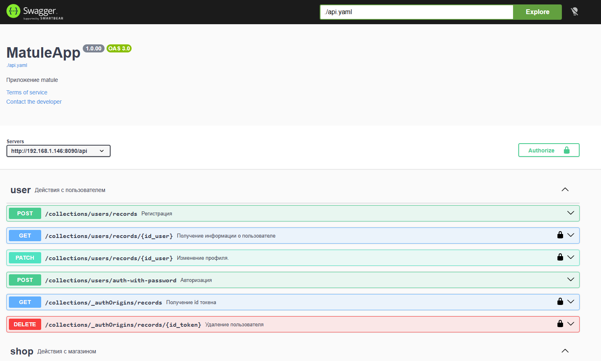
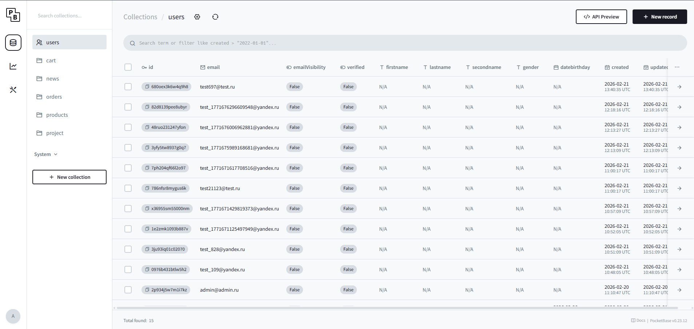

# PocketBase + Swagger UI – сервер для Matule 2026 (Профессионалы)





[](https://www.docker.com)
[](https://pocketbase.io)
[](https://swagger.io)
[](https://pro.firpo.ru)

Данный репозиторий содержит готовую Docker-сборку для быстрого развёртывания **серверной части** мобильного приложения **Matule 2026**, разрабатываемого в рамках компетенции **«Мобильная разработка» Всероссийского чемпионатного движения «Профессионалы» 2026**.

Стек включает:
- **[PocketBase](https://pocketbase.io)** – серверная часть (база данных SQLite, аутентификация, API, админ-панель).
- **[Swagger UI](https://swagger.io)** – интерактивная документация API на основе OpenAPI-спецификации.

Все данные PocketBase (база, загруженные файлы) сохраняются на вашем компьютере и не теряются после остановки контейнеров.

> 🧩 **Клиентская библиотека** для взаимодействия с этим API доступна в репозитории [`network`](https://github.com/DenUP/network).

---

## 🎯 Назначение

Этот проект предоставляет **локальное окружение**, полностью идентичное продакшн-серверу, чтобы вы могли:
- Разрабатывать и тестировать мобильное приложение без доступа к интернету.
- Изучать API через удобный Swagger UI.
- Управлять данными через админ-панель PocketBase.
- Импортировать готовую структуру коллекций (`pb_schema.json`) для быстрого старта.

---

## 📁 Структура репозитория

```
├── docker-compose.yml       # главный файл для запуска всех сервисов
├── swagger/                  # папка со Swagger UI
│   ├── Dockerfile            # инструкция для сборки образа Swagger UI
│   └── api.yaml              # OpenAPI спецификация вашего API
├── pocketbase_data/          # папка для данных PocketBase (создаётся автоматически)
├── pb_schema.json            # экспортированная схема коллекций (для импорта)
└── README.md                 # этот файл
```

---

## 🚀 Быстрый старт

### 1. Подготовка окружения

Убедитесь, что на вашем компьютере установлены:
- **Docker Desktop** – [скачать](https://www.docker.com/products/docker-desktop/). Запустите его после установки.
- **Git** – [скачать](https://git-scm.com/) (если планируете клонировать репозиторий).

### 2. Клонирование или скачивание

```bash
git clone https://github.com/DenUP/my-pocketbase-docker-matule
cd my-pocketbase-docker-matule
```

Если вы получили архив – распакуйте его в удобную папку.

### 3. Запуск контейнеров

В терминале (PowerShell, CMD или bash) выполните:

```bash
docker-compose up -d
```

Docker скачает необходимые образы и запустит два контейнера: `pocketbase` и `swagger-ui`.

### 4. Проверка работы

После успешного запуска откройте в браузере:

- **Админ-панель PocketBase** – [http://localhost:8090/_/](http://localhost:8090/_/)  
  Здесь вы будете управлять базой данных, коллекциями и пользователями.

- **Swagger UI** – [http://localhost:8080](http://localhost:8080)  
  Интерактивная документация API. Можно отправлять запросы прямо из браузера.

## 📦 5. Перенос данных из дампа и создание нового суперпользователя

После того как вы убедились, что оба сервиса работают (админ-панель PocketBase и Swagger UI открываются), выполните следующие действия:

Скопируйте содержимое папки с дампом

Перенесите все файлы из папки ```pocketbase_dump``` в папку данных вашего проекта
```E:\my-pocketbase-docker-matule\pocketbase_data.```


---

## 👤 Создание администратора PocketBase

При первом запуске PocketBase генерирует **одноразовую ссылку** для создания суперпользователя. Чтобы её получить, выполните:

```bash
docker logs pocketbase
```

Найдите строку, начинающуюся с `http://0.0.0.0:80/_/#/pbinstal/...`, скопируйте её и замените `0.0.0.0:80` на `localhost:8090`. Перейдите по этой ссылке в браузере и заполните форму для создания администратора.

---

## 📦 Импорт схемы базы данных (если нужны только таблицы(без заполнении))

В репозитории уже есть файл `pb_schema.json` с готовой структурой коллекций (пользователи, товары, проекты, корзина и т.д.). Чтобы импортировать её:

1. Зайдите в админ-панель PocketBase ([http://localhost:8090/_/](http://localhost:8090/_/)).
2. Перейдите в раздел **Settings** → **Import collections**.
3. Выберите файл `pb_schema.json` и нажмите **Import**.

После этого в базе появятся все необходимые коллекции с правильными полями и индексами.

---

## 🔗 Связь с клиентской библиотекой `network`

Для взаимодействия с этим сервером из Dart/Flutter приложения используйте библиотеку [`network`](https://github.com/DenUP/network).

Она предоставляет готовые сервисы и модели:
- `UserService` – регистрация, вход, профиль.
- `ShopService` – товары, новости, поиск.
- `ProjectService` – проекты, создание с изображением.
- `BasketService` – корзина.

Подключите библиотеку в свой `pubspec.yaml` и настройте базовый URL:

```dart
final dio = Dio(BaseOptions(baseUrl: 'http://localhost:8090/api'));
final userService = UserService(dio: dio);
```

Подробности – в [README библиотеки](https://github.com/DenUP/network).

---

## 🎨 Макет приложения

Дизайн-макет мобильного приложения доступен в Figma:  
👉 [Matule 2026 – макет](https://www.figma.com/design/pbwY6r5TtWUkxMsoJBWf0c/Matule-2026?node-id=1-2&p=f&t=E5lU1y1Emy3WN5ZN-0)

UI-компоненты (кнопки, поля, цвета) вынесены в отдельную библиотеку [`ui_kit`](https://github.com/DenUP/ui_kit).

---

## 🛑 Остановка и удаление контейнеров

- Остановить (не удаляя данные):
  ```bash
  docker-compose stop
  ```

- Полностью удалить контейнеры (данные в `pocketbase_data/` сохранятся):
  ```bash
  docker-compose down
  ```

- Чтобы удалить также том с данными (все данные будут потеряны):
  ```bash
  docker-compose down -v
  ```

---

## 📄 Лицензия

Проект распространяется под лицензией **MIT**. Это означает, что вы можете свободно использовать, копировать, изменять, объединять, публиковать, распространять, сублицензировать и/или продавать копии данного программного обеспечения при соблюдении следующих условий:

- Уведомление об авторских правах и сам текст лицензии должны быть включены во все копии или значимые части программного обеспечения.

**Отказ от ответственности:** ПРОГРАММНОЕ ОБЕСПЕЧЕНИЕ ПРЕДОСТАВЛЯЕТСЯ «КАК ЕСТЬ», БЕЗ КАКИХ-ЛИБО ГАРАНТИЙ, ЯВНЫХ ИЛИ ПОДРАЗУМЕВАЕМЫХ, ВКЛЮЧАЯ, НО НЕ ОГРАНИЧИВАЯСЬ, ГАРАНТИЯМИ ТОВАРНОЙ ПРИГОДНОСТИ, СООТВЕТСТВИЯ ПО ЕГО КОНКРЕТНОМУ НАЗНАЧЕНИЮ И ОТСУТСТВИЯ НАРУШЕНИЙ ПРАВ. НИ В КАКОМ СЛУЧАЕ АВТОРЫ ИЛИ ПРАВООБЛАДАТЕЛИ НЕ НЕСУТ ОТВЕТСТВЕННОСТИ ПО КАКИМ-ЛИБО ИСКАМ, ЗА УЩЕРБ ИЛИ ПО ИНЫМ ТРЕБОВАНИЯМ, В ТОМ ЧИСЛЕ, ПРИ ДЕЙСТВИИ КОНТРАКТА, ДЕЛИКТЕ ИЛИ ИНОЙ СИТУАЦИИ, ВОЗНИКШИМ ИЗ-ЗА ИСПОЛЬЗОВАНИЯ ПРОГРАММНОГО ОБЕСПЕЧЕНИЯ ИЛИ ИНЫХ ДЕЙСТВИЙ С НИМ.

Полный текст лицензии доступен в файле [LICENSE](LICENSE) в корне репозитория.
